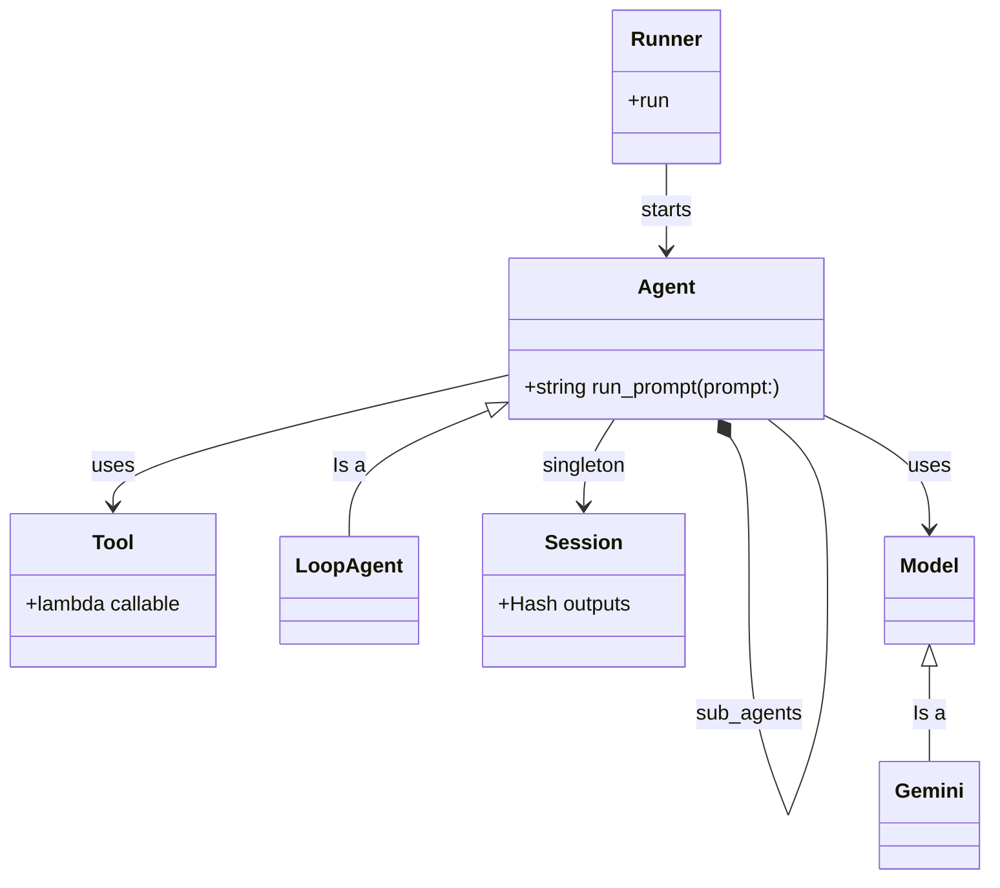

# Adk::Ruby

A proof-of-concept Ruby implementation of Agent Development Kit, inspired by Google's Python ADK.

See the [examples folder](./examples/) for how to use this.

The following diagram shows the high level class diagram
