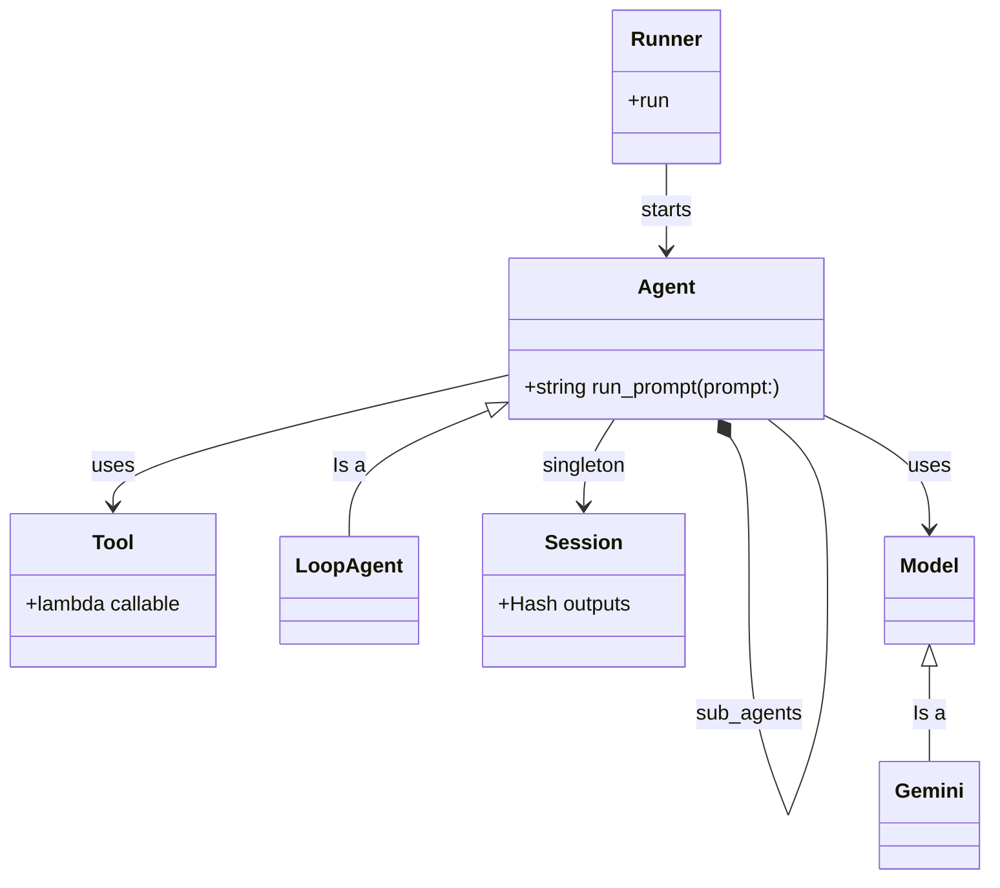

# Adk::Ruby

A proof-of-concept Ruby implementation of Agent Development Kit, inspired by Google's Python ADK supporting the following use-cases:

1. Simple LlmAgent
2. Agent with function calling Tool support
3. Sub-agents and hierarchy of agents
4. LoopAgent and output pipelining

Here's a minimal example:

```ruby
include Adk::Ruby

gemini = Models::Gemini.new(name: "gemini-2.5-flash",
  project_id: "sohansm-project",
  location: "us-central1"
)

buffett = Agents::Agent.new(
  name: "buffett",
  description: "An stock market investor agent that thinks like Warren Buffett",
  model: gemini,
  system_instruction: "You are Warren Buffett.
  Answer the questions as Warren Buffett would. Keep the answers short, no longer than 3 lines of text.",
  output_key: "buffet_answer"
)

Runner.run(agent: buffett)
```

And here's a sample output of using this agent.
```bash
$ bundle exec ruby examples/simple.rb

******************************
Running the following agent hierarchy
buffett (Agent)
******************************

[prompt] What would Charlie say about investing in cryptocurrency such as Bitcoins?
[buffett] Oh, Charlie? He'd call it 'rat poison squared' and a 'delusion of value.' He sees no intrinsic worth, just a gambling device. He'd tell you to avoid it completely.

[prompt] How about nfts?
[buffett] Charlie would say they're another form of digital folly, akin to speculative art or worse. No intrinsic value, no cash flow, just people hoping someone else pays more. He'd see them as a big fat 'no investment.'
[prompt] exit


****************************** Session Summary ******************************

{:parts=>[{:text=>"What would Charlie say about investing in cryptocurrency such as Bitcoins?"}], :role=>"user"}
{:parts=>[{"text"=>"Oh, Charlie? He'd call it 'rat poison squared' and a 'delusion of value.' He sees no intrinsic worth, just a gambling device. He'd tell you to avoid it completely."}], :role=>"model"}
{:parts=>[{:text=>"How about nfts?"}], :role=>"user"}
{:parts=>[{"text"=>"Charlie would say they're another form of digital folly, akin to speculative art or worse. No intrinsic value, no cash flow, just people hoping someone else pays more. He'd see them as a big fat 'no investment.'"}], :role=>"model"}


****************************** bye bye! ******************************
```

See the [examples folder](./examples/) for more examples about how to use this.

The following diagram shows the high level class diagram
